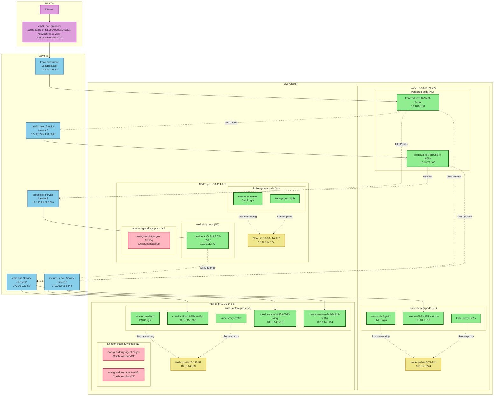

# Kubernetes Cluster Architecture Diagram

## Overview
This diagram shows the current state of the Kubernetes cluster including nodes, namespaces, pods, services, and their connectivity.

## Key Components

### Namespaces
- **kube-system**: Core Kubernetes components (DNS, metrics, networking)
- **workshop**: Application workloads (frontend, product catalog, product detail)
- **amazon-guardduty**: Security monitoring (currently experiencing issues)

### Application Architecture
- **Frontend**: Web interface exposed via LoadBalancer service
- **Product Catalog**: Internal service providing catalog data
- **Product Detail**: Internal service providing detailed product information

### Network Flow
1. External traffic enters through AWS Load Balancer
2. Load Balancer routes to frontend service
3. Frontend communicates with backend services (prodcatalog, proddetail)
4. All pods use CoreDNS for service discovery
5. CNI plugin (aws-node) handles pod networking
6. kube-proxy manages service routing on each node

### Current Issues
- GuardDuty agents are in CrashLoopBackOff state across all nodes
- This may indicate configuration or permission issues with the GuardDuty setup

Generated on: Wednesday, 2025-10-29T12:37:35.376+00:00
