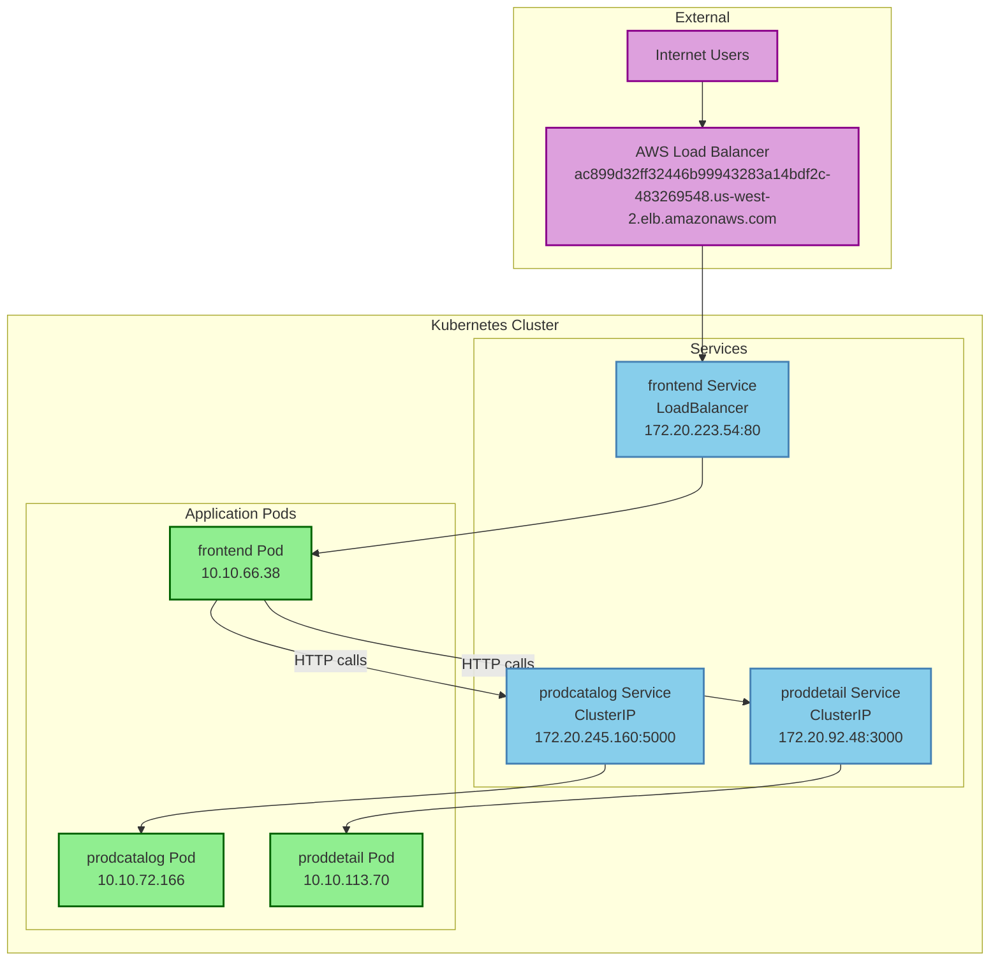

# Kubernetes Application Architecture - Simplified

## Application Flow
1. **Internet Users** → **AWS Load Balancer** → **Frontend Service** → **Frontend Pod**
2. **Frontend Pod** → **Product Catalog Service** → **Product Catalog Pod**
3. **Frontend Pod** → **Product Detail Service** → **Product Detail Pod**

*Note: No persistent databases found in the cluster - applications appear to be stateless.*
